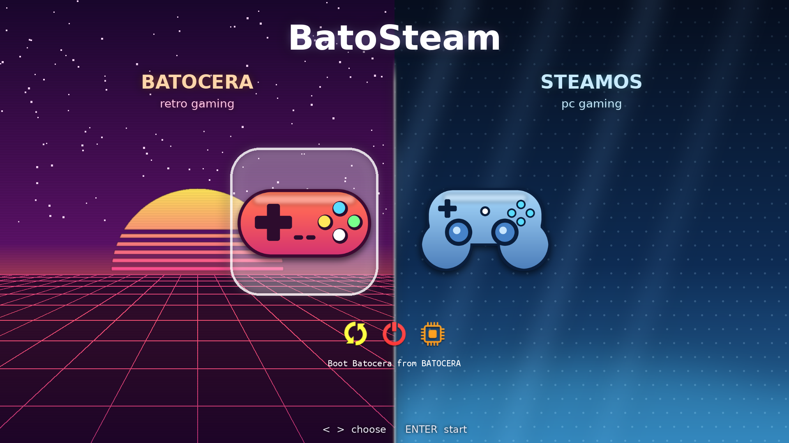
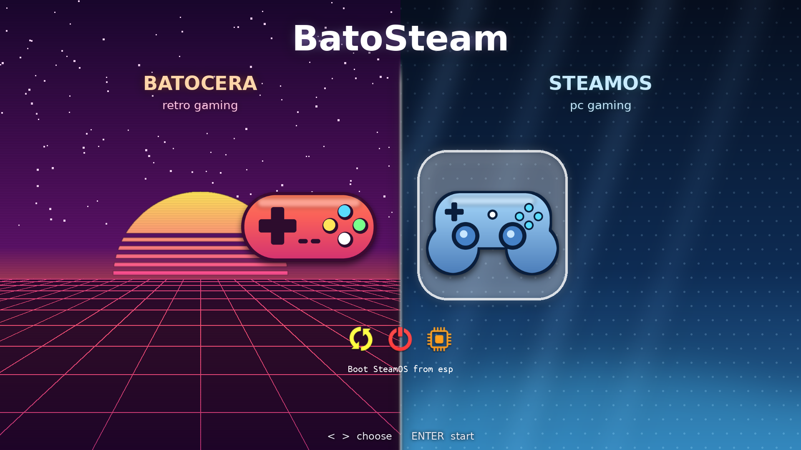

# BatoSteam Installer

**Version:** 0.4.0
**Author:** Dan Lee
**Company:** None (personal project)
**Licence:** see upstream projects for the operating systems it installs

BatoSteam installs **Batocera** (retro gaming) and **SteamOS** (Valve) on **separate drives** of the same PC. You choose a drive and format options for each OS, and a **rEFInd boot menu** at power-on lets you pick which OS to start.



*The real BatoSteam boot menu (rEFInd 0.14.2), captured in a UEFI virtual machine.*

---

## Test it safely first

Your PC's drives can't be harmed if you test like this, in order:

### Level 1: zero risk, a virtual machine (`test-vm.sh`)

`test-vm.sh` builds a **virtual BatoSteam USB key** and **two fake NVMe drives**. These are just files, and the script boots them in a UEFI virtual machine (QEMU), so your real drives are never touched. Fake NVMe 1 is the *first* NVMe, like your Batocera drive, so the risky cases are tested realistically.

```bash
# Linux PC with QEMU + OVMF installed (packages: qemu-system-x86 / qemu-full, ovmf / edk2-ovmf)
sudo ./test-vm.sh --with-batocera-installed   # fake NVMe 1 gets Batocera, like your PC
sudo ./test-vm.sh --snapshot clean            # save the fake drives (VM must be off)
```

Then try these in the VM:

| # | Test | What it proves |
|---|---|---|
| 1 | Run **BatoSteam Installer** with `--dry-run` (in its terminal) | Menus and drive list work; nothing is written |
| 2 | **Add SteamOS to my Batocera PC** → fake NVMe 2 | Batocera is left untouched; SteamOS is streamed in |
| 3 | `sudo ./test-vm.sh --no-usb` | The graphical boot menu appears; boot each OS |
| 4 | Run the installer again → **Show detected installations** | Detection and "leave untouched" work |
| 5 | `sudo ./test-vm.sh --restore clean`, then try Valve's "Wipe Device" shortcut | Shows exactly what BatoSteam protects you from |

| `test-vm.sh` option | What it does |
|---|---|
| `--with-batocera-installed` | Writes the official Batocera image to fake NVMe 1 first |
| `--no-usb` | Boots without the USB key, like a real PC after install |
| `--snapshot NAME` / `--restore NAME` / `--list-snapshots` | Save and restore both fake drives |
| `--reset` / `--reset-all` | Delete the fake drives / everything |
| `--headless` | No window; use a VNC viewer on `127.0.0.1:5901` |
| `--dir DIR`, `--mem MB`, `--cpus N` | Where files go (default `./vm-test`), RAM (default 8192 MB), CPUs (default 4) |

> In a VM there is no AMD GPU, so expect the graphics warning (just continue). SteamOS's Game Mode may show a black screen in a VM; reaching the boot menu and the SteamOS boot is enough to prove the install. Enable virtualisation (VT-x/AMD-V) in your BIOS, or the VM will be very slow.

**On Windows (VirtualBox):** convert Valve's image (decompressed with 7-Zip) with `VBoxManage convertfromraw steamdeck-repair.img usb.vdi`. Then create a VM with **EFI enabled**, 8 GB RAM and an NVMe controller, and attach `usb.vdi` plus two empty disks. Boot it and run the `--setup-usb` command from Step 1B below.

### Level 2: read-only checks on the real PC

Boot the BatoSteam USB key on your PC and only use **Show detected installations** and `sudo ./batosteam-installer.sh --dry-run`. Detection only reads; it mounts only Batocera or SteamOS partitions, and only read-only. Don't use Valve's desktop shortcuts.

### Level 3: the real install, with a safety net

1. **Back up** your Batocera drive (Clonezilla or Macrium Reflect make a full image you can restore).
2. Use **Add SteamOS to my Batocera PC**, which keeps Batocera untouched.
3. The only change outside the SteamOS drive is a **"BatoSteam" entry at the top of the firmware boot order**. Your firmware's boot menu (F8/F11/F12) can always start Batocera directly.

---

## Requirements

- 64-bit PC booting in **UEFI mode** (legacy BIOS is not supported)
- **Secure Boot OFF** (rEFInd, Batocera's EFI loader and SteamOS's steamcl are not signed for Secure Boot)
- **Two drives**: one for Batocera (16 GB or more) and one for SteamOS
- **Recommended for SteamOS:**
  - **NVMe M.2 SSD, 2 TB or larger.** Modern games are often 100 GB or more each, and NVMe keeps load times and shader compilation fast.
  - **AMD Radeon graphics.** SteamOS is built around AMD GPUs (as in the Steam Deck).
  - The installer checks both before installing SteamOS. If the drive or graphics don't meet the recommendation, it shows a warning and lets you continue anyway.
- **One USB key, 16 GB or larger.** It becomes the BatoSteam USB key: Valve's official SteamOS recovery system, plus the BatoSteam installer, plus Batocera for offline installs if you choose.
- Internet connection during install, unless you use the offline options
- Official SteamOS has no NVIDIA driver (Batocera does support NVIDIA).

> ⚠️ **SteamOS on a normal PC is unofficial.** Valve supports SteamOS 3 on Steam Deck and selected handhelds. It may boot on other PCs, but hardware support is not guaranteed. The SteamOS stage of this installer is **experimental**.

---

## How to use

SteamOS is built into BatoSteam. You don't need to make a separate Valve USB key first.

### Step 1: make the BatoSteam USB key (16 GB or larger)

Choose the method for the computer you are using to make the key.

#### A) On a Linux PC: one command (recommended)

```bash
curl -L -o batosteam.tar.gz https://github.com/yiddifliddo/BatoSteam/archive/refs/heads/main.tar.gz
tar xzf batosteam.tar.gz && cd BatoSteam-main
sudo ./make-usb.sh
```

`make-usb.sh` then does the following:
1. Asks which USB key to use and whether to include **Batocera for offline installs**
2. Downloads Valve's official **Steam Deck/Machine/PC** image and writes it to the key (the same as Valve's `bzcat … | dd` instructions)
3. Grows the key's storage area to fill the key
4. Copies BatoSteam onto the key and adds a **BatoSteam Installer** desktop shortcut
5. Moves Valve's drive-wiping shortcuts into a warning folder (see ⚠️ below)

#### B) On Windows or macOS: Valve's instructions, then one command

1. Download the SteamOS image for **Deck/Machine/PC** (**not** the Frame image, which is for Valve's ARM VR headset and will not run on a PC): <https://steamdeck-images.steamos.cloud/recovery/steamdeck-repair-latest.img.bz2>
2. Write it to a USB key:
   - **Windows:** use **Rufus**. Select the recovery file and write it to the USB key; this formats the key. When it's done, click *Close* and eject the key.
   - **macOS:** use **Balena Etcher** to write the recovery file to the USB key.
   - **Linux (manual):** use Balena Etcher, or run:
     ```bash
     bzcat steamdeck-repair-latest.img.bz2 | sudo dd if=/dev/stdin of=/dev/sdX oflag=sync status=progress bs=128M
     ```
     Replace `/dev/sdX` with your USB key.
3. Boot the PC from the key (UEFI, Secure Boot off). On the SteamOS desktop open **Terminal with repair tools** and run:
   ```bash
   curl -L https://github.com/yiddifliddo/BatoSteam/archive/refs/heads/main.tar.gz | tar xz -C /tmp
   sudo /tmp/BatoSteam-main/batosteam-installer.sh --setup-usb
   ```
   This turns the key into the BatoSteam USB key, with the same shortcut and warning folder as option A. It asks whether to add Batocera for offline installs and grows the key's storage first if needed.

> Valve's own page says an 8 GB key is enough for its older **steamdeck-recovery-4** image (SteamOS 3.1). The current image (SteamOS 3.8) is **8.1 GB**, so it needs a **16 GB** key. A 16 GB key also fits Batocera offline.

### Step 2: install

1. Plug the BatoSteam USB key into the PC, turn **Secure Boot OFF**, and boot from the USB key in UEFI mode.
2. On the SteamOS desktop, double-click **BatoSteam Installer**.
3. Follow the menus. BatoSteam first scans every drive for existing installs (see [Detecting existing installs](#detecting-existing-installs)).
   1. Choose **Install Batocera + SteamOS**, or **Add SteamOS to my Batocera PC**
   2. Pick the **Batocera drive** and a format option; if Batocera is on the key, choose offline or download
   3. Pick the **SteamOS drive** and a format option, then the **SteamOS source** (see below)
   4. Pick the **default OS** for the boot menu
   5. Check the summary and type **ERASE** to confirm
4. When it finishes, remove the USB key and reboot. The BatoSteam menu appears.

> ⚠️ **Do NOT use Valve's own desktop shortcuts on a multi-drive PC.** "Wipe Device & Install SteamOS", "Reimage Steam Deck", "Repair/Reinstall SteamOS" and "Clear local user data" **always use the first NVMe drive** (`/dev/nvme0n1`). "Wipe Device" also runs an **NVMe sanitize** that erases that drive completely, and on your PC that could be the Batocera drive. BatoSteam moves these shortcuts into a folder named *"Steam Deck only - DO NOT USE on a multi-drive PC"*, and warns you when it starts.

### Where SteamOS comes from

| Source | When to use it | How it works |
|---|---|---|
| **Download the latest SteamOS from Valve** (recommended) | Always available with internet | Valve's official Deck/Machine/PC image is **streamed**: downloaded, decompressed on the fly, and only the SteamOS system is written straight to your SteamOS drive. No temporary space and no second USB key are needed. It takes about 2–5 minutes on a fast connection. |
| **Copy SteamOS from this USB key** | Offline installs | Copies the SteamOS system the USB key is running, as Valve's own tool does. An older key, for example `steamdeck-recovery-4` with SteamOS 3.1, installs that older version, which then updates itself online. |
| **Another image file** | You already downloaded Valve's image | Accepts an `.img.bz2` (streamed) or a decompressed `.img` |

In every case, the Steam Frame image (ARM) is rejected, and the new SteamOS system is checked with `btrfs check` before it is set up.

### Running from another live Linux USB (Ubuntu, Arch, etc.)

BatoSteam also runs from other live Linux systems, downloading SteamOS itself as described above:

```bash
sudo ./batosteam-installer.sh
```

The live system needs these packages:
- `btrfs-progs`, `e2fsprogs`, `dosfstools`, `fdisk` (sfdisk)
- `bzip2` (or `lbzip2` for speed)
- `curl`, `xz`, `efibootmgr`, `unzip`
- `exfatprogs` as well, for exFAT userdata

### Command-line options

| Option | What it does |
|---|---|
| `--dry-run` | Goes through every menu and prints each command, but **writes nothing** |
| `--steamos-image URL\|FILE` | SteamOS source without asking: a URL or `.img.bz2` (streamed), or a decompressed `.img` |
| `--batocera-image FILE` | Uses a local Batocera `.img.gz` or `.img` instead of downloading one |
| `--setup-usb` | Run on Valve's recovery USB: turns it into the BatoSteam USB key |
| `--repair-boot` | Moves the BatoSteam menu back to the front of the UEFI boot order |
| `--version` / `--help` | Shows the version or help |

**`make-usb.sh` options:**

| Option | What it does |
|---|---|
| `--device /dev/sdX` | USB key to use (otherwise you choose from a list of USB drives) |
| `--with-batocera` / `--no-batocera` | Include or skip Batocera offline without asking |
| `--steamos-image URL\|FILE` | Use another SteamOS image or a local `.img.bz2` |
| `--dry-run` | Show every step, write nothing |

---

## Detecting existing installs

Every time you install, BatoSteam scans all drives and tags each one in the drive list, for example `<Batocera 43.1 - complete>` or `<SteamOS 3.7.13 - complete>`. You can also choose **Show detected installations** from the main menu.

An install can be **left untouched** only if it passes these checks:

| OS | Criteria |
|---|---|
| Batocera | Partition 1 is FAT labelled `BATOCERA`; partition 2 is labelled `SHARE`; `boot/linux`, `boot/batocera` (or `batocera.update`) and `EFI/batocera/grubx64.efi` exist |
| SteamOS | All 8 Valve partitions are present with the right names (`esp`, `efi-A`, `efi-B`, `rootfs-A`, `rootfs-B`, `var-A`, `var-B`, `home`), and `efi/steamos/steamcl.efi` is on `esp` |

If a drive passes, **"Leave existing install untouched"** is the first option for that OS. Nothing on that drive is written, and it is removed from the other OS's drive list.

If a drive fails the check (shown as `INCOMPLETE`), the only choices are to reinstall or wipe it.

If you pick a drive that holds the **other** OS, you get an extra warning before you can continue.

### Adding SteamOS to a PC that already has Batocera

Choose **"Add SteamOS to my Batocera PC"** from the main menu. BatoSteam will:
1. Find your complete Batocera drive and mark it **LEAVE UNTOUCHED**
2. Offer only the **other** drives for SteamOS (NVMe M.2, 2 TB or larger is recommended)
3. Check the drive and graphics against the recommendation
4. Install SteamOS and add a boot menu with both OSes

If your Batocera was installed with Batocera's own image (no `BSBOOT` partition), the boot menu goes on SteamOS's `esp` partition instead. Your Batocera drive is never modified.

---

## Format options

| OS | Option | Result |
|---|---|---|
| Batocera | **Wipe whole drive** | Writes the latest stable Batocera x86_64 image, grows SHARE to fill the drive and adds the 64 MiB `BSBOOT` boot-menu partition |
| Batocera | **Userdata filesystem** | SHARE is formatted as **ext4** (default), **btrfs** or **exFAT** (readable from Windows and macOS). These are the same three filesystems Batocera's own formatter supports. |
| Either | **Leave existing install untouched** | Only offered when the install passes the detection checks. Nothing is written to that drive. |
| Batocera | **Keep existing userdata** | Unpacks the latest `boot.tar.xz` over the BATOCERA partition, the same way Batocera's own updater does. ROMs, saves, BIOS files and `batocera-boot.conf` are kept. |
| SteamOS | **Wipe whole drive** | Creates Valve's 8-partition A/B layout and installs SteamOS |
| SteamOS | **Keep existing userdata** | Reinstalls both system slots and keeps `home` (installed games, Steam login) |

SteamOS always uses ext4 (with casefold) for `home`. This is required by SteamOS, so the filesystem choice only applies to Batocera.

---

## Drive layouts created

**Batocera drive**

| # | Label | FS | Size | Purpose |
|---|---|---|---|---|
| 1 | BATOCERA | FAT32 (ESP) | ~10 GiB | Batocera kernel, system and EFI loader |
| 2 | SHARE | ext4/btrfs/exFAT | rest | ROMs, saves, BIOS, settings |
| 3 | BSBOOT | FAT32 (ESP) | 64 MiB | **rEFInd boot menu** |

**SteamOS drive** (Valve's layout, sizes as in Valve's current SteamOS 3.8 script)

| # | Name | Size |
|---|---|---|
| 1 | esp | 256 MiB |
| 2–3 | efi-A / efi-B | 64 MiB each |
| 4–5 | rootfs-A / rootfs-B | 5 GiB each (btrfs, read-only) |
| 6–7 | var-A / var-B | 256 MiB each |
| 8 | home | rest (games) |

### Why the boot menu has its own partition

Batocera's updater treats unknown files on the BATOCERA partition as stale and deletes them. SteamOS's updates manage its `esp`. Keeping rEFInd on `BSBOOT` means neither OS's updates can remove the boot menu.

---

## The boot menu

A full-screen graphical menu (rEFInd) in a **split-screen** design: retro sunset on the Batocera side, steel blue on the SteamOS side, with large controller icons.

| | |
|---|---|
|  |  |

- **Left/Right** arrows choose, **Enter** starts. The default OS starts by itself after **10 s**.
- The bottom row has **Reboot**, **Power off** and **Firmware settings**.
- The default OS is highlighted as soon as the menu appears. The mouse option is off on purpose, because with it on rEFInd highlights nothing until the mouse moves.
- All artwork is original (no Batocera or Valve logos). It is generated by `tools/make-theme.py` (needs Pillow) into `config/theme/`. Edit the colours there and re-run the tool to restyle the menu.
- To use other icons (for example official logos you have the right to use), add `config/icons/os_batocera.png` and/or `config/icons/os_steamos.png` (square PNG, 512×512 recommended). They replace the theme icons automatically.

---

## Troubleshooting

- **The PC boots straight into SteamOS or Batocera without showing the menu.** An OS update or the firmware changed the boot order. Boot the USB again and run `sudo ./batosteam-installer.sh --repair-boot`, or choose "BatoSteam" as the first boot option in your firmware settings.
- **"Secure Boot violation".** Turn Secure Boot off in your firmware settings.
- **SteamOS shows a black screen.** This is usually unsupported graphics (for example NVIDIA). Batocera is unaffected.
- **Log file.** `/tmp/batosteam-install.log` on the live USB.

---

## Project structure

```
BatoSteam/
├── batosteam-installer.sh   main text-menu installer (current version)
├── make-usb.sh              builds the BatoSteam USB key (Linux)
├── test-vm.sh               safe test in a UEFI virtual machine (fake NVMe drives)
├── lib/
│   ├── common.sh            logging, menus, drive listing, safety checks
│   ├── detect.sh            existing-install detection, SteamOS hardware checks
│   ├── batocera.sh          Batocera install (wipe / keep userdata / filesystem)
│   ├── steamos.sh           SteamOS install (Valve A/B layout, any drive; USB / stream / file)
│   ├── refind.sh            rEFInd boot menu and UEFI boot order
│   └── usb.sh               all-in-one BatoSteam USB key
├── config/
│   ├── refind.conf          boot menu template
│   └── theme/               split-screen artwork (background, icons, selection glow)
├── tools/
│   └── make-theme.py        draws the boot-menu artwork and preview
├── docs/                    boot-menu screenshots and preview
├── versions/
│   ├── v0.1.0/              frozen copy of every released version
│   ├── v0.2.0/
│   ├── v0.3.0/
│   └── v0.4.0/
├── VERSION
├── README.md                this file (with change log)
└── CHANGE_CONTROL.md        formal change-control register
```

Custom menu icons: see [The boot menu](#the-boot-menu).

---

## Safety

- The drive the installer is running from is never offered as a target.
- The same drive cannot be picked for both OSes.
- "Keep userdata" is only offered when the existing layout is detected.
- "Leave untouched" is only offered when the install passes the completeness checks.
- Choosing a drive that holds the other OS needs an extra confirmation.
- Valve's first-NVMe-only shortcuts are moved into a warning folder on the BatoSteam USB key, and a warning is shown at start-up.
- The Steam Frame (ARM) image is rejected; the SteamOS system is verified with `btrfs check`.
- Wiping requires a summary confirmation **and** typing `ERASE`.
- `--dry-run` writes nothing at all.
- Downloads are checked: rEFInd by pinned SHA-256, Batocera `boot.tar.xz` by MD5, and the Batocera image by gzip integrity.

---

## Upstream sources

- Batocera: <https://github.com/batocera-linux/batocera.linux>. Image layout from `board/batocera/x86/genimage.cfg`; update method from `batocera-upgrade`.
- SteamOS: <https://github.com/ValveSoftware/SteamOS> (issue tracker only, no source code). The install steps follow Valve's `repair_device.sh` as shipped inside the official recovery images (checked against the 3.1 `steamdeck-recovery-4` and the 3.8.14 `steamdeck-repair-latest` images). Valve's USB-key instructions: <https://help.steampowered.com/en/faqs/view/65B4-2AA3-5F37-4227>
- rEFInd: <https://www.rodsbooks.com/refind/>

---

## Change log

### v0.4.0 (2026-10-01) · Author: Dan Lee
- **New: `test-vm.sh`.** Safe testing in a UEFI virtual machine, with a virtual BatoSteam USB key and two fake NVMe drives (fake NVMe 1 plays your Batocera drive). Options: `--with-batocera-installed`, snapshots and restore, `--no-usb`, headless VNC.
- **New: graphical split-screen boot menu.** Full-screen background, large original controller icons, glowing selection, larger font (rEFInd's Ubuntu Mono 24), and only the Reboot/Power off/Firmware tools shown.
- **New: `tools/make-theme.py`** generates the artwork (`config/theme/`) and a preview.
- **Verified in real rEFInd 0.14.2 under QEMU/OVMF.** Both entries are found; the screenshots in `docs/` are real captures.
- **Fix:** the mouse option is removed. With it on, rEFInd highlighted nothing (and showed no label) until the mouse moved.
- README: new "Test it safely first" and "The boot menu" sections.

### v0.3.0 (2026-09-27) · Author: Dan Lee
- **New: SteamOS is built into the installer.** It can download Valve's official image and **stream** only the SteamOS system straight to the SteamOS drive (no second USB key, no temporary space). Or it can copy from the USB key it runs on, or use a local `.img.bz2`/`.img`.
- **New: `make-usb.sh`** builds one all-in-one **BatoSteam USB key** on Linux: Valve's SteamOS recovery, BatoSteam with a desktop shortcut, and optional offline Batocera.
- **New: `--setup-usb`** turns a Valve recovery USB written on Windows or macOS (Rufus / Balena Etcher) into the BatoSteam USB key.
- **New:** offline Batocera: the installer offers the Batocera image stored on the USB key.
- **New:** warning at start-up, and a warning folder on the key, for Valve's shortcuts that always wipe the first NVMe drive ("Wipe Device" also sanitizes it).
- **New:** the Steam Frame (ARM) image is rejected; the summary shows the SteamOS and Batocera source.
- **Updated:** SteamOS partition sizes follow Valve's current script (esp 256 MiB, efi 64 MiB); `steamos-chroot --no-overlay` is used on SteamOS versions that support it.
- **Fix:** detection of Valve's recovery USB. Valve's recovery runs SteamOS from `/`, not `/run/media/liveuser/rootfs` as older public copies of the script suggested. v0.1.0 and v0.2.0 would not have recognised the real recovery USB.
- **Fix:** the running recovery system is frozen only while its system partition is being copied, as in Valve's script.
- README: Valve's USB-key instructions (Rufus, Balena Etcher, `bzcat | dd`) with a 16 GB key requirement for the current 8.1 GB image.

### v0.2.0 (2026-09-27) · Author: Dan Lee
- **New:** detects existing Batocera and SteamOS installs on every drive, with version and a complete/incomplete check (`lib/detect.sh`)
- **New:** "Leave existing install untouched" option for each OS when the install passes the checks
- **New:** "Add SteamOS to my Batocera PC" menu option (keeps Batocera, offers only the other drives)
- **New:** "Show detected installations" menu option
- **New:** drive list tags each drive with what is installed on it; an extra warning appears before overwriting the other OS
- **New:** SteamOS hardware recommendation (NVMe M.2, 2 TB or larger, AMD Radeon) checked before install, with warn-and-continue
- **Fix:** pop-up messages shown from inside the drive picker were not displayed (they went to captured output)
- **Fix:** the finish screen now says "What was done" instead of "will happen"
- **Fix:** dry-run mode now shows the real boot-menu partition that would be used
- v0.1.0 kept unchanged in `versions/v0.1.0/`

### v0.1.0 (2026-09-27) · Author: Dan Lee
Initial release.
- Text-menu installer (whiptail, then dialog, then plain-terminal fallback)
- Separate drive selection for Batocera and SteamOS, with the running USB hidden and duplicate picks blocked
- Batocera format options: wipe whole drive; SHARE as ext4, btrfs or exFAT; keep existing userdata (upgrade-style reinstall)
- SteamOS (experimental): Valve A/B layout on **any** drive (not only `/dev/nvme0n1`); wipe, or keep `home`
- rEFInd 0.14.2 boot menu on a dedicated `BSBOOT` partition, with a 10 s timeout, a selectable default OS and a fallback loader
- UEFI boot-order handling via `efibootmgr`, plus a `--repair-boot` option
- `--dry-run`, `--steamos-image` and `--batocera-image` options
- Install log at `/tmp/batosteam-install.log`
